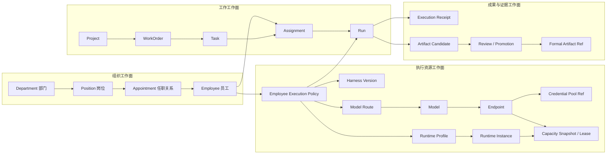

# HiveCrew B2 公司对象与数字员工执行体系

> 状态：William 已确认设计方向；B2 尚未进入实现或生产发布
> 记录日期：2026-08-11
> 产品：HiveCrew — HiveCosm 数字员工协作与执行系统
> 基线：B1 `85d927ebc3a3ecd2f685f1f932865f9906c2c446`
> 决策范围：公司对象、数字员工用工、执行资源、任务与成果的统一语义

## 1. 为什么需要这份设计

HiveCosm 历史上同时存在多代数字员工与执行方式：具名但未绑定执行资源的员工、Hermes 文件型 Agent、CLI Runtime Agent、由 API 驱动的 Worker、LiteLLM/HDEO 调度对象，以及 HiveCrew 当前继承的 Agent、Runtime、Issue、Task Queue、Skill 和 Squad。

这些资产都应保留，但不能继续把以下概念统称为“Agent”：

- 公司里的员工身份；
- 部门与岗位；
- Runtime 和在线实例；
- 模型与 API Endpoint；
- Harness、Skill 和工具；
- 一次派工、一次执行或一个临时 Worker。

本设计的目的不是再建设一套公司真源，而是为 HiveCrew 的互动与执行能力建立清晰的对象语言和反腐适配边界，使现有 HiveCosm 真源能够被准确读取、连接和操作。

## 2. 总体决策

### 2.1 不建设十套互相割裂的注册表

HiveCrew 使用一套统一的公司对象注册框架，分为四个工作面：

1. **组织工作面**：Department、Position、Appointment、Employee。
2. **执行资源工作面**：Runtime Profile、Runtime Instance、Harness Version、Model、Endpoint、Credential Pool、Capacity。
3. **工作工作面**：Project、WorkOrder、Task、Assignment、Run。
4. **成果与证据工作面**：Execution Receipt、Artifact Candidate、Review、Promotion、Formal Artifact Reference。

关系图谱是上述对象显式关系的派生索引，不是第二套事实真源。

### 2.2 身份、能力和执行资源必须分离

- 员工不是模型。
- 员工不是 Runtime。
- API 不是 Runtime。
- Harness 不是模型。
- Endpoint 是一个可访问的部署入口，不等于模型或 Runtime。
- Task 不是一次执行；Run 才是一次执行尝试。
- Artifact Candidate 不是正式成果；只有通过 Review 和 Promotion 后才能成为 HiveCosm 正式成果引用。

### 2.3 HiveCosm 与 HiveCrew 的权威边界不变

- HiveCosm 继续拥有部门、岗位、员工、公司项目、治理、知识和正式成果真源。
- LiteLLM/模型路由权威继续拥有模型路由、额度、成本和凭据引用。
- HiveCrew 拥有对话、派工、Task Run、执行凭证和临时成果。
- HiveCrew 通过 Anti-Corruption Layer 读取公司对象，通过显式命令请求公司真源变更，不直接双写真源。

## 3. 对象关系



## 4. 组织工作面

### 4.1 Department

部门是稳定的组织单元，描述使命、职能边界、上级部门、负责人岗位、制度和生命周期。部门记录不得嵌入员工列表、模型或实时在线状态；这些关系分别由 Appointment 和运行态投影表达。

建议核心字段：

- `department_id`
- `parent_department_ref`
- `name`、`short_name`、`purpose`
- `responsibility_refs`
- `manager_position_ref`
- `policy_refs`
- `cost_center_ref`
- `lifecycle_state`
- `effective_from`、`effective_to`

### 4.2 Position

岗位是一把可被任职的“椅子”，不是员工本人。岗位描述责任、权限、能力要求、预期成果、汇报关系和验收责任。

建议核心字段：

- `position_id`
- `department_ref`
- `title`、`level`
- `responsibility_contract`
- `required_capability_refs`
- `required_skill_refs`
- `authority_scope`
- `expected_output_types`
- `acceptance_policy_ref`
- `reports_to_position_ref`

### 4.3 Employee

员工是稳定的公司身份，回答“这个人是谁”，不永久绑定某个模型、API、Runtime 或端口。

建议核心字段：

- `employee_id`
- `display_name`、`avatar_ref`、`profile_ref`
- `employee_type`：human / digital
- `employment_state`：active / standby / training / dormant / retired
- `appointment_refs`
- `capability_profile_ref`
- `memory_namespace_ref`
- `execution_policy_ref`
- `work_result_refs`

### 4.4 Appointment

Appointment 是 Employee、Position 和 Department 的有时效关系。它支持一人多职、临时项目岗位、部门迁移、历史组织回放和明确上下级。

建议核心字段：

- `appointment_id`
- `employee_ref`
- `position_ref`
- `department_ref`
- `appointment_type`：primary / secondary / acting / project
- `supervisor_appointment_ref`
- `effective_from`、`effective_to`
- `provenance`

## 5. 执行资源工作面

### 5.1 Runtime Profile 与 Runtime Instance

Kimi CLI、Qwen CLI、Codex、OpenCode、Hermes、Pi 等属于 Runtime 类型；API 不是 Runtime。

`RuntimeProfile` 描述调用机制、协议、命令、会话恢复、子 Agent、Worktree、沙箱和主机要求。`RuntimeInstance` 描述某台主机上实际在线的实例、版本、心跳、占用任务和可用并发。

### 5.2 Harness Version

Harness 是员工工作的操作制度与装备包，必须版本化，包含：

- System Prompt 与角色指令；
- Skills、MCP 和工具引用；
- 记忆与知识上下文策略；
- 权限、Guardrail 与沙箱策略；
- 子 Agent 和团队策略；
- 输出 Schema、评审和失败恢复规则。

Harness 可以选择 Runtime、Model Route 和工具，但不等于它们。

### 5.3 Model、Endpoint 与 Credential Pool

`Model` 只描述规范模型身份、版本、能力、上下文窗口和成本事实，不保存密钥。

Endpoint 至少分为：

- `ModelEndpoint`：模型推理 API 部署；
- `RuntimeEndpoint`：Runtime daemon 或远程 Worker 控制入口；
- `ToolEndpoint`：MCP、数据库、搜索等工具服务；
- `SandboxEndpoint`：QM 或其他联合工作沙箱入口。

`CredentialPoolRef` 只保存 Provider、套餐、额度规则和 Keychain/Vault 引用，不保存 secret value。

### 5.4 Capacity

容量不是一个简单的并发数字，应分为：

- 硬件容量：CPU、GPU、内存、显存和磁盘；
- Runtime 容量：在线实例、最大并发、忙碌和排队数；
- 模型额度：TPM、RPM、5小时/7天/30天窗口、预算和重置时间；
- 当前可用性：online、busy、backoff、quota_exhausted；
- `CapacityLease`：某个 Assignment/Run 临时占用的资源租约。

## 6. 工作、执行和成果

### 6.1 Project、WorkOrder、Task、Assignment、Run

- `Project` 是长期项目容器，由 HiveCosm 项目真源管理。
- `WorkOrder` 表达目标、范围、约束、验收、优先级、期限和依赖。
- `Task` 是可以由一名员工或一个团队执行的工作单元。
- `Assignment` 是本次把 Task 派给哪名员工、使用何种执行策略的选择，不是员工永久绑定。
- `Run` 是一次实际执行尝试，同一个 Task 可以有多次 Run。

必须保持：

```text
Project -> WorkOrder -> Task -> Assignment -> Run -> Terminal/Session
```

### 6.2 Execution Receipt 与 Artifact 生命周期

每次 Run 生成 append-only Execution Receipt，记录员工、精确 Runtime/Harness/Model/Endpoint/Capacity 快照、输入摘要、时间、Token、成本、工具调用、Trace ID、错误和输出 Hash。

Run 产生的是 `ArtifactCandidate`。候选成果经过 Review 后可以返工、拒绝或通过显式 Promotion 进入 HiveCosm 正式成果真源；HiveCrew 仅保存临时成果和正式成果引用。

## 7. 数字员工用工决策

### 7.1 不把每个 Skill 配成一名永久员工

外部“42 Skills 覆盖7个部门”的图是能力矩阵，不是专业组织结构图。其中包含 Skill、Workflow、Tool、业务场景和少量可能形成岗位的能力。若直接创建42名永久员工，会造成重复身份、闲置上下文、配置维护和协调成本。

岗位可以先完整规划并注册；只有在出现长期责任、持续记忆、独立授权、稳定工作量或独立对话关系时，才激活正式员工。

### 7.2 三层用工结构

1. **核心正式数字员工**：稳定姓名、岗位、记忆、责任和成果记录，长期出现在组织架构、名册、对话和派工界面。
2. **按需专业数字员工**：岗位和模板已注册，处于 planned / vacant / standby / training / dormant 状态，需要时激活。
3. **弹性执行 Worker**：由责任员工按 WorkOrder/Task 创建的临时 Run 执行实例；拥有独立上下文、Worktree、Run ID 和凭证，任务结束后可销毁，不冒充正式员工。

### 7.3 第一批核心员工建议

系统开发期先激活约10至12个责任岗位：

- CEO / 总协调；
- 产品与需求负责人；
- 首席架构师；
- 前端与交互负责人；
- 后端与平台负责人；
- Runtime 与基础设施负责人；
- 数据与知识工程师；
- 项目与交付经理；
- 测试与验收负责人；
- 安全与独立审查负责人；
- UI/UX 设计师；
- 文档与组织记忆负责人。

营销、社交媒体、财务、法务和商业运营可先注册部门、岗位、Skill 和 Workflow，待实际运营工作稳定出现后再激活员工。财务付款、报税、合同签署和正式法律意见保留人类责任边界。

### 7.4 并行速度不等于员工数量

```text
有效并行度 = min(
  已拆清且无依赖的任务数,
  隔离 Worktree / Sandbox 数,
  可用 Runtime 实例数,
  Model Endpoint 可用容量,
  集成与验收吞吐能力
)
```

应优先建立前端、后端、测试、调研、数据迁移和独立审查等弹性 Worker Pool。一个员工可以在其责任范围内组织多个 Worker；同一模型或 Runtime 也可以服务多个员工，员工身份不因资源切换而变化。

## 8. 历史 Agent 类型的归一化

| 历史对象 | B2 中的归类 |
| --- | --- |
| HiveCrew/原 Multica CLI Agent | Runtime Profile/Instance；只有绑定 Employee 后才是公司员工的执行入口 |
| 直接 API 调用的大模型 | Model + ModelEndpoint + CredentialPoolRef，不是员工也不是 Runtime |
| LiteLLM | 模型路由、额度和成本服务，不是员工 |
| HDEO CodeTeam | Dispatch/Scheduler 服务与 Worker Pool，不是员工 |
| Orca | Worktree、会话和 Runtime 编排适配器，不是员工 |
| Hermes 文件型 Agent | Employee + Harness/Profile + Runtime Binding |
| 只有名字和岗位的历史 Agent | Employee/Position 设计记录，执行状态为 unbound 或 dormant |
| QM | Sandbox/Joint-work Endpoint 与人机联合工作环境 |
| A2A Agent Card | 远程 Runtime Endpoint 的能力和认证描述，不是员工身份真源 |
| MCP | ToolEndpoint 与工具 Schema，不是员工、模型或 Runtime |

旧来源不被删除。Anti-Corruption Adapter 将旧记录归一化，并输出重复、冲突、缺失和来源新鲜度报告；未确认的冲突不得静默合并。

## 9. 与成熟开源项目的关系

| 参考体系 | HiveCrew 吸收的骨头 | 不复制的部分 |
| --- | --- | --- |
| Backstage | 对象目录、统一引用、Owner、显式关系、来源摄入 | 不作为员工或项目第二真源 |
| Kubernetes | `apiVersion/kind/metadata/spec/status`、期望与观测状态分离 | 不在B2复制集群控制器复杂度 |
| HiveCrew 现有基础 | Inbox、Chat、Agent、Issue、Task Queue、Runtime、Skill、Squad、Automation UI 与执行机制 | 不把现有 Agent 表升级成公司身份真源 |
| LiteLLM | 模型路由、Endpoint、Credential Pool、预算、额度与成本 | 不重建模型网关 |
| DeerFlow / OpenAI Agents SDK | Harness、记忆、工具、Skill、沙箱、子 Agent 和 Handoff 的组合方式 | 不作为组织注册表 |
| Temporal | 持久任务、Run、事件历史、重试和 Worker Queue 语义 | B2 暂不安装完整 Temporal 平台 |
| OpenTelemetry | Trace、Span、Metric、Log 与执行凭证关联 | 不作为业务对象注册表 |
| A2A | 远程 Agent Endpoint、能力和认证发现 | 不作为员工身份 |
| MCP | 工具和上下文访问协议 | 不作为 Runtime 或员工 |

参考：

- Backstage Software Catalog: <https://backstage.io/docs/features/software-catalog/>
- Kubernetes Objects: <https://kubernetes.io/docs/concepts/overview/working-with-objects/>
- Claude Code Subagents: <https://code.claude.com/docs/en/sub-agents>
- LiteLLM Routing: <https://docs.litellm.ai/docs/routing>
- Temporal Task Queues: <https://docs.temporal.io/task-queue>
- OpenTelemetry Traces: <https://opentelemetry.io/docs/concepts/signals/traces/>
- A2A Specification: <https://github.com/a2aproject/A2A/blob/main/docs/specification.md>
- MCP Tools Specification: <https://github.com/modelcontextprotocol/modelcontextprotocol/blob/main/docs/specification/2026-07-28/server/tools.mdx>

## 10. 统一对象外壳

```yaml
apiVersion: hivecosm.io/v1alpha1
kind: Employee
metadata:
  id: EMP-EXAMPLE-001
  name: Example
  labels: {}
  source_ref: hivecosm://organization/employee/EMP-EXAMPLE-001
  revision: 1
  content_digest: sha256:...
spec:
  # 被治理和批准的稳定字段
status:
  # 系统观测到的当前状态
  observed_at: 2026-08-11T00:00:00+08:00
  freshness: fresh
relations:
  - type: appointed_to
    target_ref: position://engineering/example
    valid_from: 2026-08-11T00:00:00+08:00
    provenance: hivecosm://organization/appointment/APT-EXAMPLE-001
```

HiveCrew 的读取投影必须附带 `source_ref`、`source_revision`、`content_digest`、`observed_at`、`freshness` 和 `write_capability`。缺失或冲突时明确显示来源缺口，不以 UI 写入成功代替公司真源变更成功。

## 11. B2 实施节奏与阶段成果

### B2.0 术语与权威冻结

成果：对象词典、Schema 边界、URI/引用规则、权威矩阵、旧 `AgentRuntimeProfile` 混合语义的替代方案。

### B2.1 组织注册适配

成果：Department、Position、Appointment、Employee read model；旧来源适配器；冲突报告；组织架构与员工名册 API。

### B2.2 执行资源目录

成果：Runtime、Harness、Model、Endpoint、Credential Pool、Capacity read model；可用性和新鲜度投影。

### B2.3 员工执行绑定

成果：EmployeeExecutionPolicy、候选资源解析器、精确资源快照；员工可切换资源但身份保持不变。

### B2.4 任务与成果链

成果：Project、WorkOrder、Task、Assignment、Run、Receipt、Artifact Candidate 和 Promotion 引用模型。

### B2.5 受控垂直闭环

成果：从一名真实员工、一个真实 WorkOrder 出发，解析准入资源，完成一次受控 Run，生成候选成果和执行凭证。B2只证明对象、适配和闭环契约；Owner 工作台属于B3，大规模并发和恢复属于B4。

## 12. 与 HiveCrew 基础审查的关系

在继续叠加 HiveCosm 之前，William 先审查独立 HiveCrew 基础，重点确认：

1. Homepage 与产品定位；
2. Workspace、Inbox、Chat、My Work；
3. Agent、Task/Issue、Project、Automation；
4. Runtime、Skill、Squad、Analytics、Settings；
5. 哪些交互流程应保留、改名、合并或隐藏；
6. 哪些页面只缺 HiveCosm 数据接入，哪些交互本身需要重构。

审查阶段不接入 HiveCosm 真源、不修改1421、不替换DGX生产服务。审查结论形成页面能力矩阵后，才进入B2实现和B3工作台设计。

## 13. 当前未改变边界

- 本文是设计记录，不代表B2已经实现。
- B1代码、B1验证结果和精确候选修订未改变。
- 未写 HiveCosm 员工、部门、项目、模型或其他注册表。
- 未调用真实员工、Runtime、模型Endpoint或凭据。
- 未修改DGX、1421、数据库、生产服务或发布状态。
